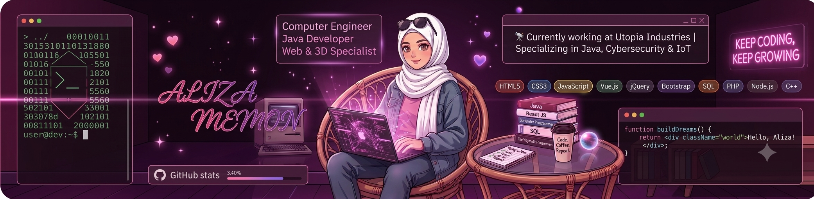

<!-- ============================================================
  Aliza Memon — GitHub Profile README
============================================================ -->

<div align="center">

<!-- Custom banner image — upload it to your repo (e.g. assets/banner.png)
     and swap the src below, OR host it on imgur/postimages and paste the link -->


<br/>

<!-- Animated typing intro -->
<a href="https://git.io/typing-svg">
  
</a>

</div>

<p align="center">
  
</p>

<p align="center">
  <a href="https://linkedin.com/in/aliza-memon-engr/"></a>
  <a href="mailto:alizanisar11@gmail.com"></a>
  <a href="https://portfolioaliza.netlify.app/"></a>
  
</p>

---

### 💫 About Me

```yaml
name: Aliza Memon
role: Computer Engineer | Java Developer | Cybersecurity Researcher
location: Karachi, Pakistan
current_work: "Trainee Engineer @ Utopia Industries — Java, Spring Boot, IoT"
research_interest: "Post-Quantum Cryptography & Privacy-Preserving Systems"
education: "B.E. Computer Engineering — Sir Syed University of Engineering & Technology"
fun_fact: "I balance engineering with baking cookies and muffins 🍪"
```

- 🔭 Currently building **Fleet Management** & **Warehouse Inventory** systems in Java/Spring Boot at **Utopia Industries**
- 🔐 Deep diving into **Post-Quantum Cryptography**, lightweight security protocols & quantum-safe design
- 🎓 B.E. Computer Engineering graduate — SSUET (GPA 3.5)
- 🏆 Silver Medalist — 39th Multi-topic International Symposium (Research Thesis)
- 🥈 2nd Position — Mindscape-VR, 40th IEEEP All Pakistan Students Seminar
- 🌱 Currently exploring applied ML for intrusion detection & secure system design
- 💬 Ask me about **cryptography, secure system design, Java/Spring Boot or React/Three.js**

---

### 🛠️ Tech Stack & Tools

<p align="center">
  
</p>

<div align="center">


</div>

---

### 🔐 Featured Projects

<p align="center">
  <a href="https://github.com/alizamemon/Cyber_Assurance_Framework">
    
  </a>
  <a href="https://github.com/alizamemon/ML--Intrusion-Detection-Prevention-System">
    
  </a>
</p>
<p align="center">
  <a href="https://github.com/alizamemon/Secure_ML_chat_app">
    
  </a>
  <a href="https://github.com/alizamemon/Secure_Medical_Image_System">
    
  </a>
</p>

| Project | Highlights |
|---|---|
| 🛡️ **Cyber Assurance Framework** | STRIDE threat modeling, encryption, RBAC — mapped to ISO/IEC 27001 & GDPR |
| 🧠 **ML-Based Intrusion Detection (IDPS)** | CICIDS 2017 dataset, Random Forest, SMOTE balancing, real-time IP blacklisting |
| 💬 **Secure ML Chat App** | Custom RSA handshake + per-session AES-EAX encryption, TF-IDF spam classifier |
| 🏥 **Secure Medical Image Storage** | AES-256 + SHA-256, RBAC, secure key management for medical data |

---

### 📈 GitHub Analytics

<p align="center">
  
  
</p>

<p align="center">
  
</p>

<p align="center">
  
</p>

<!-- 🐍 Contribution Snake — animated, updates automatically via GitHub Action (setup steps below) -->
<p align="center">
  
</p>

---

### 🏆 Achievements

<p align="center">
  
</p>

- 🥇 Merit Based Scholarship Awardee — Sindh Education & Endowment Fund (SEEF)
- 🥈 Silver Medal — Research Thesis Presentation, 39th Multi-topic International Symposium 2025
- 🥈 2nd Position — Innovative Research Project (Mindscape-VR), 40th IEEEP All Pakistan Students Seminar
- 🌟 Best IoT Project — Computer Engineering In-house Project Exhibition (CIPE'25)
- 🥈 2nd Position — Computer Engineering Workshop Project, SSUET

---

### 📜 Certifications

<details>
<summary>Click to expand 🔽</summary>
<br/>

- 🔐 **Fundamentals of Encryption & Quantum-Safe Techniques** — IBM
- 🚨 **Cyber Threat Management** — Cisco Networking Academy
- 🖥️ **Endpoint Security** — Cisco Networking Academy
- 🛡️ **Cybersecurity Fundamentals** — IBM
- 🤖 **AI Foundations Associate** — Oracle University
- 🎯 **Aspire Leadership Program** — Harvard University

</details>

---

### 🤝 Let's Connect

<p align="left">
<a href="https://linkedin.com/in/aliza-memon-engr/" target="blank"></a>
<a href="mailto:alizanisar11@gmail.com" target="blank"></a>
<a href="https://portfolioaliza.netlify.app/" target="blank"></a>
</p>

<p align="center">
  
</p>

